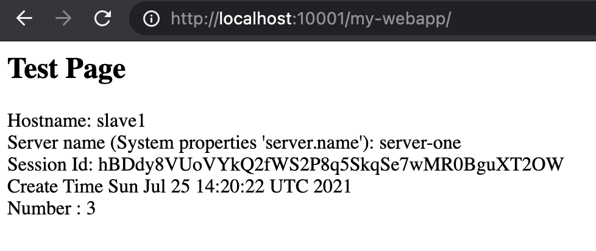

# Wildfly Session Replication Demo

This repository contain artifacts for demostrate wildfly HA with jbcs http server as frontend proxy

## Requirements

1. Docker / Docker compose https://docs.docker.com/compose/install/
2. Access to [Red Hat JBoss Core Services Apache HTTP Server 2.4.37 for RHEL 7 x86_64](https://access.redhat.com/jbossnetwork/restricted/softwareDetail.html?softwareId=75551&product=core.service.apachehttp&version=&downloadType=distributions)
3. Java / Maven packge (Optional)

## Topology


| Hostname | Private IP address | Expose Port | Description                 |
| -------- | ------------------ | ----------- | --------------------------- |
| proxy1   | 172.16.238.11      | 10001       | Apache HTTP Server          |
| proxy2   | 172.16.238.12      | 10002       | Apache HTTP Server          |
| master   | 172.16.238.21      | 9990        | Domain Controller (Wildfly) |
| slave1   | 172.16.238.22      | 18080       | Host Controller 1 (Wildfly) |
| slave2   | 172.16.238.23      | 28080       | Host Controller 2 (Wildfly) |


## Building demo-proxy docker image

1. Download the RedHat [Red Hat JBoss Core Services Apache HTTP Server 2.4.37 for RHEL 7 x86_64](https://access.redhat.com/jbossnetwork/restricted/softwareDetail.html?softwareId=75551&product=core.service.apachehttp&version=&downloadType=distributions)

2. Copy and place it under "demo_proxy" folder
3. Run docker build

```
cd demo_proxy
docker build -t demo-proxy .
```

## Building demo-wildly docker image

1. Run docker build

```
cd demo_wildfly
docker build -t demo-wildfly .
```

## Build the demo application (Optional)

1. ```
   cd demo_app
   mvn package
   ```

## Launch the cluster

1. Run docker-compose up

```
docker-compose up
```


## Test the load balancer

1. Access the mod cluster manager, confirm you can see both server-one and server-two registered themself.

```
http://localhost:10001/mod_cluster-manager

or

http://localhost:10002/mod_cluster-manager
```


## Deploy the demo application

1. Access the domain controller web console from browser

```
http://localhost:9990
```

```
username : admin
password : password
```

2.  Click on deployment tab


3. Choose Server group -> Other Server Group -> + -> Upload new deployment


4. Select demo_app/target/my-webapp.war to upload, click next and finish


## Testing the demo application

1. Access the application from server one (Port 18080)

```
http://localhost:18080/my-webapp/
```


2. Access the application from server two (Port 28080)

```
http://localhost:28080/my-webapp/
```


3. Access the application from load balancer 1 (Port 10001)

```
http://localhost:10001/my-webapp/
```



4. Depends on Hostname and servername display on Test Page, try stop the serving server. (In this case slave1/server-one). From domain controller console, goto Runtime -> Server Groups -> other-server-group -> server-one -> stop


5. Confirm the load balancer has removed server-one (should be auto)


6. Refresh test page from load balancer and notice the change in Hostname and Server name (slave1->slave2, server-one -> server-two, Notice the session id remain the same and the Number should increment from previous number.

```
http://localhost:10001/my-webapp/
```


